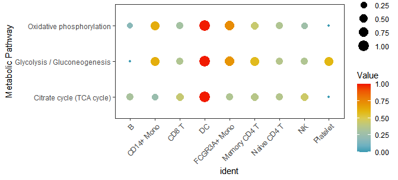

## 01 安装及数据导入
```R
install.packages(c("devtools", "data.table", "wesanderson", "Seurat", "devtools", "AUCell", "GSEABase", "GSVA", "ggplot2","rsvd"))
devtools::install_github("YosefLab/VISION@v2.1.0") #Please note that the version would be v2.1.0
devtools::install_github("wu-yc/scMetabolism")
library(scMetabolism)
library(ggplot2)
library(rsvd)
load(file = "pbmc_demo.rda")
```

## 02 量化单细胞代谢水平
```R
countexp.Seurat<-sc.metabolism.Seurat(obj = countexp.Seurat, 
                  method = "AUCell", 
                  imputation = F, 
                  ncores = 2, 
                  metabolism.type = "KEGG")

```
- `obj`: 单细胞Seurat对象
- `method`：可选择VISION（默认）, AUCell, ssgsea, gsva.
- `imputation`：允许用户选择是否在代谢评分前对其数据进行估算.
- `ncores`：并行计算线程数.
- `metabolism.type`：可选择 `KEGG`（85条通路）或 `REACTOME`（82条通路）

## 03 提取代谢评分
```R
metabolism.matrix <- countexp.Seurat@assays$METABOLISM$score
```
## 04 可视化
### 04-1 Dimplot：特定pathway的umap降维可视化
```R
DimPlot.metabolism(obj = countexp.Seurat, 
          pathway = "Glycolysis / Gluconeogenesis", 
          dimention.reduction.type = "umap", 
          dimention.reduction.run = F, 
          size = 1)
```


### 04-2 Dotplot：特定pathways集合的score点图
```R
input.pathway<-c("Glycolysis / Gluconeogenesis", "Oxidative phosphorylation", "Citrate cycle (TCA cycle)")
DotPlot.metabolism(obj = countexp.Seurat, pathway = input.pathway, phenotype = "ident", norm = "y")
```
- `obj`：单细胞Seurat对象
- `pathway`：pathways集合
- `phenotype`: Seurat对象metadata信息中的某个表型数据
- `norm`：对行或列归一化，可以选择`x`或`y`或`na`


### 04-3 Boxplot：特定pathways的箱线图
```R
BoxPlot.metabolism(obj = countexp.Seurat,
                pathway = input.pathway,
                phenotype = "ident",
                ncol = 1)
```
- `obj`：单细胞Seurat对象
- `pathway`：pathways集合
- `phenotype`: Seurat对象metadata信息中的某个表型数据
- `ncol`: 指绘图过程中每行的列数

